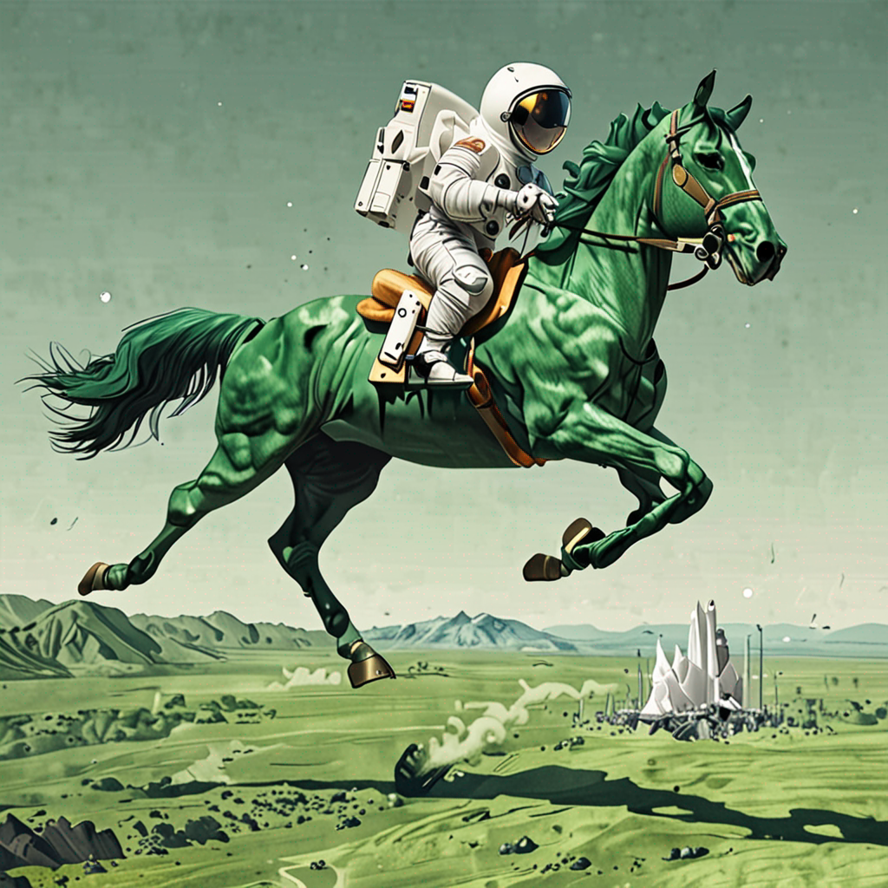

# Metamorph: Text to Image and Video Generator

Welcome to the Metamorph repository! This project leverages advanced AI models to transform textual descriptions into stunning visuals and videos. 
Currently, the image generation functionality is fully implemented.

**Note: The video generation functionality is currently in progress and will be added in future updates.**

## Features
 - Image Generation: Utilize the state-of-the-art Stable Diffusion model to generate high-quality images from textual descriptions.
 - Video Generation: We are working on adding video generation capabilities to transform text into dynamic and engaging videos.

## Technical Implementation
 - Frontend Integration: Developed with Flask for the frontend, providing a seamless and user-friendly interface.
 - Gradio Integration: Gradio is used to interface with the Stable Diffusion model hosted on Hugging Face Spaces, ensuring efficient and reliable image generation.
[Github Code](https://github.com/Veda0718/Image-Generator-SDXL)

## Features
 - **Intuitive Interface:** Craft detailed prompts and explore various image styles with ease.
 - **Multiple Styles:** Choose from various styles such as Cinematic, Photographic, Anime, Digital Art, Fantasy Art, and 3D Model.
 - **Customizable Settings:** Fine-tune image dimensions, guidance scale, and apply negative prompts to refine your output.
 - **Examples:** Predefined examples to quickly see the potential of the model.

## How to Get Started
 - **Landing Page:** Click on "Get Started" to begin generating images.
 - **Enter Your Prompt:** Input the text description of the image you want to generate.
 - **Adjust Settings:** Modify advanced settings such as image style, width, height, and guidance scale.
 - **Generate Images:** Click the "Generate" button to create your image.
 - **Download Image:** Select your desired image from the Gallery and download it.

## Getting Started
To run this project locally, follow these steps:

1. Clone the repository:
```
git clone https://github.com/Veda0718/Text_to_Image_Video_Generator.git
cd Text_to_Image_Video_Generator
```
2. Ensure the [Hugging Face Space](https://huggingface.co/spaces/Veda0718/Text_to_Image_Generator) is running
3. Run the application:
```
python app.py
```
Open the provided URL in your web browser to access the application.

## Example Prompts
"An astronaut riding a green horse"<br>
"A delicious ceviche cheesecake slice"<br>
"A serious capybara at work, wearing a suit"<br>
"A Squirtle fine dining with a view to the London Eye"<br>
"A graffiti of a robot serving meals to people"<br>
"A beautiful cabin in Attersee, Austria, 3d animation style"<br>

<div style="display: grid; grid-template-columns: repeat(2, 1fr); grid-gap: 20px;">
  
  
  
  
</div>

## Acknowledgements
Metamorph harnesses the cutting-edge Stable Diffusion XL (SDXL) model by StabilityAI, offering unparalleled text-to-image generation, while acknowledging potential biases and content considerations outlined in the model card.

## Contributions
Contributions to this project are welcome! If you have any ideas, bug reports, or feature requests, please open an issue or submit a pull request.
